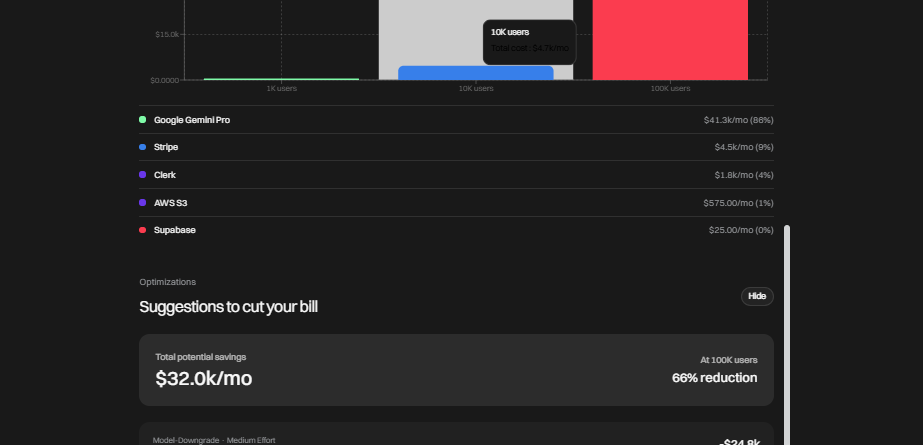

# CloudCost AI

> Describe your app idea in plain English. CloudCost AI identifies the cloud services you need, projects costs from 1K to 100K users, and sends a signed cost report for stakeholder approval.

**Live demo:** [cloudcost-ai.druxamb.dev](https://cloudcost-ai.druxamb.dev/)
**Demo video:** [https://youtu.be/C1UGOzpRDek](https://youtu.be/C1UGOzpRDek)

Built for the World Cloudx Hackathon 2026 by Team DruxAMB.

---

## What it does

You type a plain-English description of an app you want to build — "a SaaS app where users upload documents, chat with AI about them, and pay for premium features." CloudCost AI:

1. **Identifies the services** — Gemini reasons about your description and maps it to real cloud services (hosting, database, AI, storage, payments, auth, search) with per-user usage estimates.
2. **Projects the cost** — SerpApi fetches live pricing data, and the cost engine projects your monthly bill at 1K, 10K, and 100K users.
3. **Suggests optimizations** — Gemini analyzes the cost breakdown and recommends specific savings (model downgrades, caching, tier changes).
4. **Generates a signed report** — A PDF cost report is generated, processed through Nutrient's document pipeline for data extraction, and routed through Doctavian's e-signature workflow for legally binding stakeholder approval.



---

## Architecture

```
User (browser)
  │
  ▼
Next.js App (Vercel)          ← Landing page + app overlay
  │
  ├── POST /api/analyze       ← Gemini identifies services from description
  │     │
  │     ├── SerpApi           ← Live pricing data for each service
  │     └── Google Gemini     ← Reasons about architecture + usage
  │
  ├── POST /api/optimize      ← Gemini suggests cost optimizations
  │
  ├── POST /api/report        ← Nutrient DWS pipeline
  │     │
  │     ├── Nutrient Processor API   ← Generates PDF from analysis data
  │     └── Nutrient Data Extraction ← Extracts structured fields + confidence scores
  │
  └── POST /api/doctavian     ← Doctavian e-signature flow
        │
        ├── pdfkit            ← Generates PDF report locally
        ├── Doctavian Storage ← Uploads PDF to signature storage
        ├── Doctavian Envelope API ← Creates envelope with positioned signature fields
        └── MSAL OAuth        ← Refresh-token flow keeps integration alive

Xano Backend (external)
  │
  └── POST /analyze           ← Orchestrates the full flow, persists results
        ├── Calls Next.js API ← Delegates to Gemini + SerpApi
        └── cost_analysis table ← Stores structured analysis with record ID
```

### Request flow

1. User submits app description → Xano receives the request
2. Xano calls the Next.js API → Gemini + SerpApi produce the analysis
3. Xano stores the result in its database → returns to frontend
4. User reviews cost projection → clicks "Generate Report"
5. Nutrient generates PDF + extracts structured data with confidence scores
6. User enters signer details → clicks "Send for Signature"
7. Doctavian uploads the PDF, creates a signature envelope, and emails the signer

---

## Sponsor integrations

| Sponsor | Prize track | What it does | Verified |
|---|---|---|---|
| **Doctavian** | Generate It Right. Sign It Tight. ($1,000) | PDF upload, envelope creation with positioned signature fields, email delivery to signer, OAuth refresh-token flow | Real envelope ID + consumption metrics returned |
| **Nutrient** | Turn Documents Into Something People Actually Trust | PDF generation via Processor API, structured data extraction with per-field confidence scores and audit trail | 17 fields extracted, 85.2% average confidence |
| **SerpApi** | Search API prize track | Live Google search results for cloud provider pricing pages, fed into Gemini's analysis prompt | `pricingSource: "live (SerpApi)"` in analysis response |
| **Xano** | Backend prize track | Receives analysis requests, orchestrates the Next.js API call, persists structured results with record IDs | Record ID 11 returned, data persisted to `cost_analysis` table |

---

## Tech stack

- **Next.js 16** (App Router, TypeScript) — landing page + API routes
- **Google Gemini** (`gemini-3.6-flash`) — service identification + optimization
- **SerpApi** — live cloud pricing data
- **Nutrient DWS** — PDF generation + data extraction
- **Doctavian** — e-signature envelope workflow
- **Xano** — request orchestration + data persistence
- **GSAP + Lenis** — landing page animation and smooth scroll
- **Tailwind CSS** — styling with sponsor-synced accent palette

---

## Getting started

### Prerequisites

- Node.js 20+
- npm 10+

### Install and run

```bash
git clone https://github.com/druxamb/cloudcost-ai.git
cd cloudcost-ai
npm install
cp .env.example .env.local
# Fill in your API keys (see below)
npm run dev
```

Open [http://localhost:3000](http://localhost:3000) and click "Try the demo."

### Environment variables

| Variable | Required | Description |
|---|---|---|
| `GEMINI_API_KEY` | Yes | Google Gemini API key |
| `SERPAPI_API_KEY` | Yes | SerpApi key for live pricing |
| `NUTRIENT_PROCESSOR_API_KEY` | Yes | Nutrient DWS Processor API |
| `NUTRIENT_DATA_EXTRACTION_API_KEY` | Yes | Nutrient DWS Data Extraction API |
| `DOCTAVIAN_API_KEY` | Yes | Doctavian API key |
| `NEXT_PUBLIC_XANO_API_BASE` | Yes | Xano workspace API base URL |

---

## Project structure

```
cloudcost-ai/
├── src/
│   ├── app/
│   │   ├── api/
│   │   │   ├── analyze/route.ts      ← Gemini + SerpApi analysis
│   │   │   ├── optimize/route.ts     ← Cost optimization suggestions
│   │   │   ├── report/route.ts       ← Nutrient PDF pipeline
│   │   │   └── doctavian/route.ts    ← Doctavian signature flow
│   │   ├── components/
│   │   │   ├── AppSlot.tsx           ← The app overlay (analysis UI)
│   │   │   ├── Hero.tsx              ← Landing hero with floating widgets
│   │   │   ├── CustomerStories.tsx   ← Proof section (real measurements)
│   │   │   └── ...
│   │   ├── content.ts                ← All landing page content
│   │   ├── page.tsx                  ← Landing page composition
│   │   └── globals.css               ← Design tokens + animations
│   └── lib/
│       ├── cost-engine.ts            ← Projects costs at 1K/10K/100K users
│       ├── serpapi-pricing.ts        ← Live pricing via SerpApi
│       ├── nutrient-dws.ts           ← PDF generation + data extraction
│       ├── doctavian-client.ts       ← Signature envelope API client
│       ├── msal-auth.ts              ← OAuth device flow for Doctavian
│       ├── pdf-report.ts             ← PDF generation with pdfkit
│       └── xano-client.ts            ← Xano backend client
├── xano-workspace/                   ← Xano API + table definitions
├── public/
│   └── cost-analysis.png             ← Cost breakdown screenshot
└── package.json
```

---

## Verification

All sponsor integrations were tested with real API calls during development:

- **Analyze API:** 5 services identified in 39.1s with live SerpApi pricing
- **Nutrient pipeline:** 17 fields extracted at 85.2% confidence, 4.5s processing
- **Doctavian:** Real envelope ID and document URN returned with consumption metrics
- **Xano:** Analysis persisted with record ID 11

Every figure in the proof section on the landing page was measured on this build.

---

## License

MIT — see [LICENSE](./LICENSE)

---

## Team

Built by **DruxAMB** for the World Cloudx Hackathon 2026.
